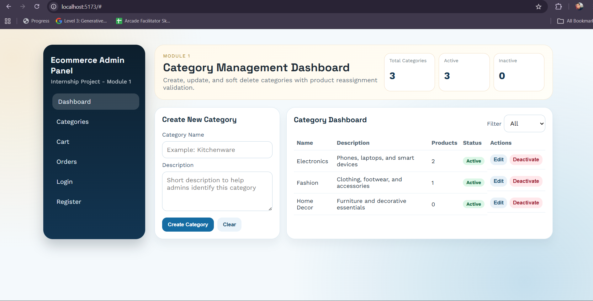
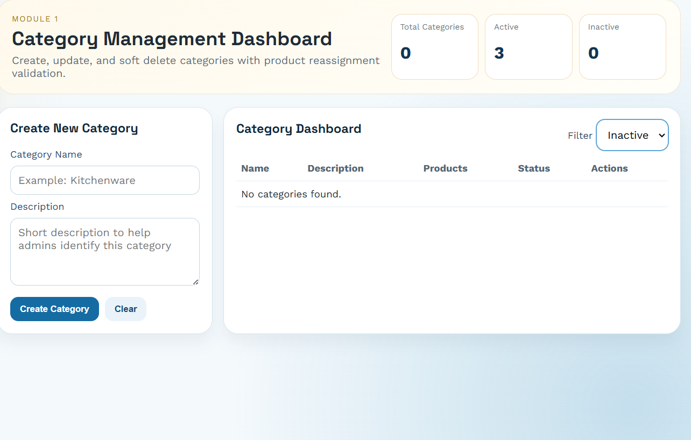
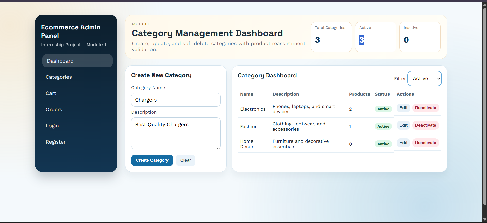
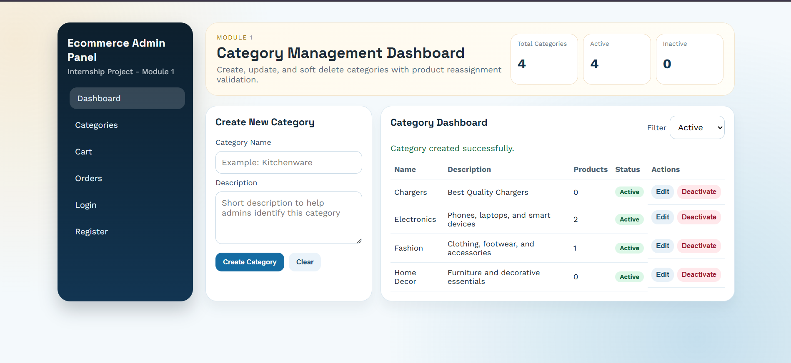
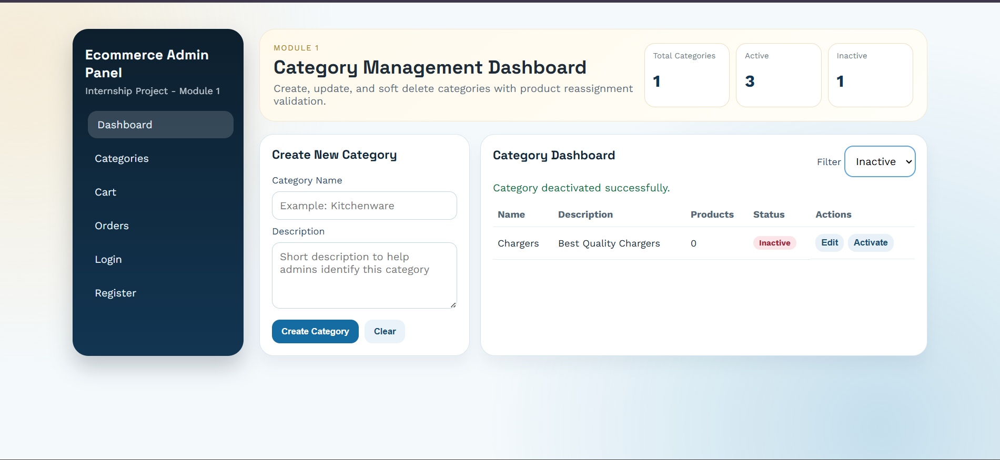

# E-Commerce-Website

This is my internship project for an Ecommerce system.

I have completed **Module 1 (Category Management)**, **Module 2 (Order Management)**, **Module 3 (Customer Management)**, **Module 4 (Payment Management)**, **Module 5 (Cart Management)**, **Module 6 (Wishlist Management)**, and **Module 7 (Shipping Management)** in this repository.

## Candidate Details

- Name: Shreyash Tekriwal
- Project: Ecommerce Website
- Internship Modules: Module 1 - Category Management, Module 2 - Order Management, Module 3 - Customer Management, Module 4 - Payment Management, Module 5 - Cart Management, Module 6 - Wishlist Management, Module 7 - Shipping Management
- Tech Stack: React, Node.js, Express, SQL

## Tech Stack

- Frontend: React + Vite + Axios  
- Backend: Node.js + Express
- Database: SQLite (relational SQL schema, easy local setup)

## Modules Completed

### Module 1: Category Management
- Create new category
- Category dashboard with list and product count
- Update category name and description
- Soft delete/deactivate using status column
- Product reassignment check before category deactivation

### Module 2: Order Management
- View all customer orders with status filters
- Order dashboard with pending/shipped/delivered/cancelled statistics
- Update order status (Pending → Shipped → Delivered)
- Cancel orders with validation (cannot cancel shipped/delivered)
- Order details modal with order items and customer information
- Soft delete implementation via status column

### Module 3: Customer Management
- Create new customer profiles
- View customer dashboard with status filter (all/active/inactive)
- Edit customer details (name, email, phone)
- Deactivate customer accounts (soft delete)
- Reactivate inactive customer accounts
- Real-time customer statistics (total, active, inactive)

### Module 4: Payment Management
- Process payments for orders using payment methods (credit/debit card, PayPal, bank transfer)
- Store transaction references and payment gateway metadata
- Admin dashboard for payment history and status filters
- Refund payments for cancelled orders
- Track payment statistics (paid, failed, refunded, collected amount)

### Module 5: Cart Management
- Add products to cart with stock validation
- Update cart quantity with inventory checks
- Remove items from cart with total recalculation
- Customer cart dashboard with product, quantity, and total amount
- Admin cart dashboard with active carts and abandoned cart insights
- Real-time cart totals using stored total_price values

### Module 6: Wishlist Management
- Add products to wishlist for future purchase consideration
- View wishlist with product name, price, and availability
- Remove products from wishlist
- Move products from wishlist to cart in one action
- Real-time wishlist summary for each customer
- Integrated navigation with existing modules on same dashboard

### Module 7: Shipping Management
- Calculate shipping costs based on order amount and package weight
- Admin dashboard to view all shipments with status filtering
- Create shipping records for orders with auto-generated tracking numbers
- Track shipments by tracking number (customer-facing feature)
- Update shipping information including courier service and status (Shipped, In Transit, Delivered)
- Real-time shipping statistics (total shipments, status breakdown, total cost)
- Random courier assignment from major carriers (FedEx, UPS, DHL, Amazon, Local)

## Live Deployment Links

- **Frontend**: https://e-commerce-website-woad-eta.vercel.app
- **Backend Health**: https://ecommerce-backend-2s98.onrender.com/api/health

## Project Structure

- `frontend/`: React user interface with Vite build tool
- `backend/`: Express API + SQL schema + database logic
- `backend/scripts/`: Utility scripts for database management

## Database Tables Included

- `users` - User accounts and authentication
- `categories` - Product categories
- `products` - Product catalog
- `cart` - Shopping cart items
- `orders` - Customer orders
- `order_items` - Order line items
- `payments` - Payment records
- `cart` - Cart items, quantity, and total price per line item
- `wishlist` - Wishlist records for saved products
- `wishlist` - User wishlist items
- `shipping` - Shipping records with tracking number, courier service, and status

## How To Run

### 1. Install dependencies

```bash
cd backend && npm install
cd ../frontend && npm install
```

### 2. Configure environment files

**Backend** (`.env`):
```
NODE_ENV=development
PORT=5000
```

**Frontend** (`.env`):
```
VITE_API_BASE_URL=http://localhost:5000/api
```

### 3. Start backend server

```bash
cd backend && npm run dev
```

Backend runs on: `http://localhost:5000`

### 4. Start frontend server (new terminal)

```bash
cd frontend && npm run dev
```

Frontend runs on: `http://localhost:5173`

## APIs Reference

### Module 1 - Category Management

- `GET /api/health` - Health check
- `GET /api/categories?status=all|active|inactive` - List categories
- `POST /api/categories` - Create category
- `PUT /api/categories/:id` - Update category
- `PATCH /api/categories/:id/status` - Change category status

### Module 2 - Order Management

- `POST /api/orders` - Place order from cart
- `GET /api/orders?order_status=pending|shipped|delivered` - List orders with filters
- `GET /api/orders/:id` - Get order details with items
- `PUT /api/orders/:id/status` - Update order status
- `PATCH /api/orders/:id/cancel` - Cancel order

### Module 3 - Customer Management

- `POST /api/customers` - Create customer
- `GET /api/customers?status=all|active|inactive` - List customers with filter
- `GET /api/customers/:id` - Get customer details
- `PUT /api/customers/:id` - Update customer profile
- `PATCH /api/customers/:id/deactivate` - Deactivate customer
- `PATCH /api/customers/:id/reactivate` - Reactivate customer

### Module 4 - Payment Management

- `POST /api/payments` - Process payment
- `GET /api/payments?payment_status=all|paid|failed|refunded` - List payments with filters
- `PATCH /api/payments/:id/refund` - Refund payment for cancelled/returned order

### Module 5 - Cart Management

- `GET /api/carts/products` - List products for cart add form
- `POST /api/carts/items` - Add product to cart
- `PUT /api/carts/items/:id` - Update cart item quantity
- `DELETE /api/carts/items/:id` - Remove item from cart
- `GET /api/carts/:customerId` - Get customer cart dashboard
- `GET /api/carts/admin/dashboard` - Get admin cart abandonment dashboard

### Module 6 - Wishlist Management

- `GET /api/wishlists/products` - List products for wishlist add form
- `POST /api/wishlists/items` - Add item to wishlist
- `GET /api/wishlists/:customerId` - View customer wishlist
- `DELETE /api/wishlists/items/:id` - Remove item from wishlist
- `PATCH /api/wishlists/items/:id/move-to-cart` - Move wishlist item to cart

### Module 7 - Shipping Management

- `GET /api/shippings/dashboard?shipping_status=all|Shipped|In Transit|Delivered` - Admin dashboard with all shipments
- `POST /api/shippings` - Create shipping record for order
- `GET /api/shippings/track/:tracking_number` - Track shipment by tracking number (customer)
- `GET /api/shippings/order/:order_id` - Get shipping info by order ID
- `PATCH /api/shippings/:shipping_id` - Update shipping information (courier, tracking, status)
- `GET /api/shippings/calculate-cost?order_amount=X&weight=Y` - Calculate shipping cost

## Sample API Requests

### Create Category

```json
POST /api/categories
{
  "category_name": "Electronics",
  "description": "Phones, laptops, and accessories"
}
```

### Update Order Status

```json
PUT /api/orders/1/status
{
  "order_status": "shipped"
}
```

### Cancel Order

```
PATCH /api/orders/1/cancel
```

## Module Features Documentation

### Module 1: Category Management - End User Guide

1. **Open Dashboard** - Frontend loads with category list and stats
2. **Create Category** - Fill form with name and description, click Create
3. **Update Category** - Click Edit, modify details, click Save Changes
4. **Deactivate Category** - Click Deactivate, optionally reassign products
5. **Activate Category** - Filter to Inactive, click Activate
6. **Use Filters** - Switch between All, Active, and Inactive views

### Module 2: Order Management - End User Guide

1. **View Orders** - Dashboard displays all orders with customer details
2. **Filter Orders** - Use status filter to view Pending, Shipped, or Delivered orders
3. **View Order Details** - Click View button to see order items and customer info
4. **Update Status** - From order details modal, update order status as it progresses through workflow
5. **Cancel Order** - Cancel pending orders before shipment
6. **Track Statistics** - Stats cards show total and status breakdown

### Module 3: Customer Management - End User Guide

1. **Open Module 3** - Click "Module 3: Customers" in the sidebar
2. **Add Customer** - Click "Add New Customer", enter name/email/phone, submit form
3. **View Customers** - Review customer table with joined date and account status
4. **Filter Customers** - Use filter to view All, Active, or Inactive customers
5. **Edit Profile** - Click "Edit" to update customer details
6. **Deactivate/Reactivate** - Use action buttons to soft delete or restore account

### Module 4: Payment Management - End User Guide

1. **Open Module 4** - Click "Module 4: Payments" in the sidebar
2. **Process Payment** - Enter order ID, payment method, optional amount, and gateway, then submit
3. **Track Transactions** - View payment ID, order ID, customer, method, amount, and status
4. **Filter Payments** - Filter by Paid, Failed, or Refunded transactions
5. **Issue Refund** - Click refund on paid payments after associated order is cancelled
6. **Monitor Stats** - Check total transactions and collected amount cards

### Module 5: Cart Management - End User Guide

1. **Open Module 5** - Click "Module 5: Cart" in sidebar
2. **Add to Cart** - Select customer ID, product, and quantity, then click Add to Cart
3. **Review Cart** - View product lines with price, quantity, and total amount
4. **Update Quantity** - Click Update Qty and enter new quantity
5. **Remove Item** - Click Remove to delete cart line item
6. **Admin Monitoring** - Use Admin Cart Dashboard to track active and abandoned carts

### Module 6: Wishlist Management - End User Guide

1. **Open Module 6** - Click "Module 6: Wishlist" in sidebar navigation
2. **Add to Wishlist** - Choose customer and product, then click Add to Wishlist
3. **View Wishlist** - Review wishlist list with name, price, and stock availability
4. **Move to Cart** - Click Move to Cart to transfer an item directly to customer cart
5. **Remove Item** - Click Remove to delete product from wishlist
6. **Track Summary** - Monitor total wishlist items from stats card

### Module 7: Shipping Management - End User Guide

**For Admin Users:**
1. **Open Module 7** - Click "Module 7: Shipping" in sidebar navigation
2. **View Dashboard** - See all shipments with status, courier, and cost information
3. **Filter by Status** - Use dropdown to view Shipped, In Transit, or Delivered shipments
4. **Create Shipping** - Enter order ID, optionally courier and tracking, then create
5. **Update Shipping** - Click Edit on any shipment to update courier, tracking number, or status
6. **Calculate Costs** - Use cost calculator tab to determine shipping for given order amount and weight

**For Customers:**
1. **Track Shipment** - Use Track Shipment tab to enter tracking number and view status
2. **View Status** - See current delivery status (Shipped, In Transit, Delivered)
3. **Courier Info** - View which carrier is handling the shipment
4. **Order Link** - See which order the shipment is associated with

## End User Screenshots

### Module 1 Screenshots

- Dashboard Overview - 
- Filter Inactive State - 
- Create Form - 
- Success Message - 
- Deactivated View - 

## Architecture Highlights

- **Soft Delete Pattern**: Uses `status` column (1 for active, 0 for inactive) for data integrity
- **Modular Frontend**: Single App component with navigation between modules
- **RESTful API**: Standard HTTP methods for CRUD operations
- **Responsive Design**: Mobile-friendly CSS Grid layouts
- **Error Handling**: Comprehensive error messages at API and UI levels
- **Separated Concerns**: Controllers handle business logic, routes handle HTTP routing

## Next Modules Planned

- Module 8: Analytics & Reporting (Sales, Revenue, Customer insights)
